# 🔨 PromptForge

**Centralised prompt lifecycle management for OpenClaw agent swarms.**

[](https://www.python.org/downloads/)
[](https://fastapi.tiangolo.com)
[](https://supabase.com)
[](LICENSE)
[](SPEC.md#14-phased-delivery)

---

PromptForge is a version-controlled prompt registry and composition engine built for multi-agent systems. It treats agent prompts as first-class artefacts — storing, versioning, composing, and tracking them across the entire lifecycle. Agents resolve their identity at boot time by composing prompts from reusable components (personas, skills, constraints), with full provenance tracking and usage analytics.

## Architecture

```mermaid
graph LR
    subgraph Warren["Warren Swarm"]
        K["👑 King"]
        W["🐇 Workers"]
        S["🔍 Scouts"]
        A["🏗️ Architect"]
    end

    subgraph PF["🔨 PromptForge"]
        API["FastAPI"]
        R["Registry"]
        V["VCS"]
        C["Composer"]
    end

    DB[(Supabase)]
    OC["OpenClaw\nOverlay"]

    K -->|compose| API
    W -->|resolve| API
    W -->|log usage| API
    A -->|design/refine| API
    API --> R & V & C
    R & V & C --> DB
    K -.->|spawn| W & S
    OC -.-> K & W & S & A
```



## Key Features

- **Prompt Registry** — CRUD storage with slugs, tags, types, and metadata
- **Version Control** — Git-like commits, branches, structural diffs, rollback
- **Composition Engine** — Assemble agent identities from reusable components
- **Smart Resolution** — Select versions by strategy (latest, pinned, best-performing)
- **Usage Analytics** — Track prompt performance across agents
- **PromptArchitect** — AI agent for prompt design, refinement, and evaluation
- **Provenance** — Composition manifests trace every agent back to exact prompt versions

## How Agents Use It


## Quick Start

### Prerequisites

- Python 3.12+
- Supabase project ([supabase.com](https://supabase.com))
- Docker (optional, for deployment)

### Install

```bash
git clone https://github.com/DarlingtonDeveloper/PromptForge.git
cd PromptForge
python -m venv .venv
source .venv/bin/activate
pip install -r requirements.txt
```

### Configure

```bash
cp .env.example .env
# Edit .env with your Supabase URL, key, etc.
```

### Run Migrations

Apply `prompt_forge/db/migrations/001_initial.sql` to your Supabase project via the SQL editor.

### Run

```bash
make run
# or
uvicorn prompt_forge.main:app --host 0.0.0.0 --port 8400 --reload
```

API docs at [http://localhost:8400/docs](http://localhost:8400/docs)

## API Overview

| Endpoint | Method | Description |
|----------|--------|-------------|
| `/api/v1/prompts` | `GET/POST` | List/create prompts |
| `/api/v1/prompts/{slug}` | `GET/PUT/DELETE` | Get/update/archive prompt |
| `/api/v1/prompts/{slug}/versions` | `GET/POST` | Version history / commit |
| `/api/v1/prompts/{slug}/diff` | `GET` | Structural diff |
| `/api/v1/prompts/{slug}/rollback` | `POST` | Rollback to version |
| `/api/v1/compose` | `POST` | Compose agent prompt |
| `/api/v1/resolve` | `POST` | Resolve single component |
| `/api/v1/usage` | `POST` | Log usage event |
| `/api/v1/usage/stats/{slug}` | `GET` | Usage statistics |

## Project Structure

```
prompt_forge/
├── main.py              # FastAPI app
├── config.py            # Settings
├── api/                 # REST endpoints
│   ├── prompts.py       # Prompt CRUD
│   ├── versions.py      # Version control
│   ├── compose.py       # Composition
│   ├── usage.py         # Usage logging
│   └── models.py        # Pydantic models
├── core/                # Business logic
│   ├── registry.py      # Prompt registry
│   ├── vcs.py           # Version control
│   ├── composer.py      # Composition engine
│   ├── resolver.py      # Smart resolution
│   └── differ.py        # Structural diffing
├── architect/           # PromptArchitect agent
├── db/                  # Supabase client & migrations
├── docker/              # Deployment
└── utils/               # Security & logging
```

## Roadmap

| Phase | Focus | Status |
|-------|-------|--------|
| **Phase 1** | Foundation — Registry, VCS, Composition, API | 🟢 Current |
| **Phase 2** | Intelligence — Branching, analytics, A/B testing | 🔲 Planned |
| **Phase 3** | Autonomy — Self-optimisation, marketplace, federation | 🔲 Future |

See [SPEC.md](SPEC.md) for full details.

## License

[MIT](LICENSE) © 2026 Mike Darlington
