# PromptForge — Specification

> Centralised Prompt Lifecycle Management for OpenClaw Agent Swarms

**Version:** 1.0  
**Date:** February 2026  
**Author:** Mike Darlington

---

## Table of Contents

1. [Executive Summary](#1-executive-summary)
2. [System Context — The Warren Swarm](#2-system-context--the-warren-swarm)
3. [What This Architecture Enables](#3-what-this-architecture-enables)
4. [Agent Boot and Identity Resolution](#4-agent-boot-and-identity-resolution)
5. [Technology Stack](#5-technology-stack)
6. [Data Model](#6-data-model)
7. [Version Control System](#7-version-control-system)
8. [Composition Engine](#8-composition-engine)
9. [PromptArchitect Agent](#9-promptarchitect-agent)
10. [API Specification](#10-api-specification)
11. [Deployment](#11-deployment)
12. [Integration Points](#12-integration-points)
13. [Security](#13-security)
14. [Phased Delivery](#14-phased-delivery)
15. [Open Questions](#15-open-questions)

---

## 1. Executive Summary

PromptForge is a centralised prompt lifecycle management service designed to serve OpenClaw agent swarms. It provides version-controlled storage, composition, resolution, and analytics for the system prompts that define agent identity and behaviour.

In a swarm architecture like Warren, agents are ephemeral — they boot, resolve their identity from prompts, execute tasks, and terminate. The prompts that define *who they are* and *how they behave* are the most critical artefacts in the system. PromptForge treats these prompts as first-class, version-controlled, composable resources with full provenance tracking.

### Core Capabilities

- **Prompt Registry** — CRUD storage for prompt components (personas, skills, constraints, templates)
- **Version Control** — Git-like versioning with branches, diffs, and merge strategies
- **Composition Engine** — Assemble agent identities from reusable prompt components
- **Smart Resolution** — Select the right prompt version based on context, performance, or policy
- **PromptArchitect** — An AI agent that designs, refines, and evaluates prompts
- **Usage Analytics** — Track which prompts perform well and surface insights

---

## 2. System Context — The Warren Swarm

PromptForge operates within the Warren swarm architecture — a multi-agent system orchestrated by OpenClaw.

```mermaid
graph TB
    subgraph Warren["Warren Swarm"]
        King["👑 King (Orchestrator)"]
        Workers["🐇 Workers (Specialists)"]
        Scouts["🔍 Scouts (Research)"]
        Architect["🏗️ PromptArchitect"]
    end

    subgraph PromptForge["PromptForge Service"]
        API["REST API"]
        Registry["Prompt Registry"]
        VCS["Version Control"]
        Composer["Composition Engine"]
        Resolver["Smart Resolver"]
    end

    subgraph Storage["Supabase"]
        DB[(PostgreSQL)]
    end

    King -->|"resolve identity"| API
    Workers -->|"fetch prompts"| API
    Scouts -->|"log usage"| API
    Architect -->|"design/refine"| API
    API --> Registry
    API --> VCS
    API --> Composer
    API --> Resolver
    Registry --> DB
    VCS --> DB
```



### Warren Agent Types

| Agent | Role | Prompt Forge Interaction |
|-------|------|--------------------------|
| **King** | Orchestrates the swarm, delegates tasks | Resolves worker identities at spawn time |
| **Workers** | Execute specific tasks (coding, writing, analysis) | Boot with composed prompts, log usage outcomes |
| **Scouts** | Research and gather information | Fetch context-specific prompt variants |
| **PromptArchitect** | Designs and refines prompts | Full CRUD + composition + evaluation |

---

## 3. What This Architecture Enables

### 3.1 Dynamic Agent Identity

Agents don't have hardcoded system prompts. Instead, they resolve their identity at boot time from PromptForge. This means:

- The same agent type can behave differently based on context
- Identity can evolve without redeploying agents
- A/B testing of agent behaviours becomes trivial

### 3.2 Agent Evolution

With version control, prompts evolve over time:

- Every change is tracked with full history
- Branches allow experimental prompt variants
- Rollback is instant if a prompt change causes regressions

### 3.3 Cross-Agent Learning

Usage logging enables the system to learn which prompts work:

- Track success/failure rates per prompt version
- Surface insights: "Version 3 of the code-review persona has 40% better outcomes"
- Feed performance data back into prompt design

### 3.4 Provenance

Every agent interaction can be traced back to the exact prompt composition that produced it:

- **Composition manifests** record exactly which components were used
- **Version pinning** ensures reproducibility
- **Audit trails** for compliance and debugging

### 3.5 Composable Archetypes

Instead of monolithic prompts, PromptForge encourages composition:

```
Agent Identity = Persona + Skills[] + Constraints[] + Context
```

- **Persona**: Core identity and communication style
- **Skills**: Domain-specific capabilities (e.g., "python-expert", "code-reviewer")
- **Constraints**: Behavioural guardrails (e.g., "concise-output", "no-speculation")
- **Context**: Runtime variables (project name, user preferences)

---

## 4. Agent Boot and Identity Resolution

When an agent boots within the Warren swarm, it follows this sequence:

```mermaid
sequenceDiagram
    participant King as 👑 King
    participant PF as 🔨 PromptForge
    participant Agent as 🐇 Worker

    King->>PF: POST /compose
    Note over King,PF: persona: "code-reviewer"<br/>skills: ["python", "security"]<br/>constraints: ["concise"]

    PF->>PF: Resolve each component<br/>(latest version, main branch)

    PF->>PF: Compose into final prompt<br/>+ generate manifest

    PF-->>King: Composed prompt + manifest

    King->>Agent: Spawn with system prompt

    Agent->>Agent: Execute task

    Agent->>PF: POST /usage
    Note over Agent,PF: Log outcome, latency,<br/>composition manifest
```



### Resolution Strategy

The resolver selects prompt versions using configurable strategies:

| Strategy | Description |
|----------|-------------|
| `latest` | Most recent version on the specified branch (default) |
| `pinned` | Exact version number — for reproducibility |
| `best_performing` | Version with highest success rate from usage logs |

---

## 5. Technology Stack

| Component | Technology | Rationale |
|-----------|-----------|-----------|
| **API Framework** | FastAPI (Python 3.12+) | Async, fast, OpenAPI docs, Pydantic validation |
| **Database** | Supabase (PostgreSQL) | Managed Postgres, RLS, real-time, auth |
| **Content Storage** | JSONB columns | Structured prompt content with flexible schema |
| **Diffing** | Custom structural differ | Section-level diffs for prompt content |
| **Agent Runtime** | OpenClaw | PromptArchitect runs as an OpenClaw agent |
| **Deployment** | Docker + Docker Swarm | Secrets management, service orchestration |
| **Logging** | structlog | Structured JSON logging |

---

## 6. Data Model

### 6.1 Entity Relationship Diagram


### 6.2 Prompt Content Schema (JSONB)

The `content` field in `prompt_versions` stores structured prompt data:

```json
{
  "sections": [
    {
      "id": "identity",
      "label": "Identity",
      "content": "You are a senior Python developer..."
    },
    {
      "id": "skills",
      "label": "Skills",
      "content": "You excel at code review, testing..."
    },
    {
      "id": "constraints",
      "label": "Constraints",
      "content": "Always explain your reasoning..."
    },
    {
      "id": "output_format",
      "label": "Output Format",
      "content": "Respond in markdown with code blocks..."
    }
  ],
  "variables": {
    "project_name": "{{project_name}}",
    "language": "{{language}}"
  },
  "metadata": {
    "estimated_tokens": 450,
    "target_model": "claude-sonnet-4-20250514"
  }
}
```

### 6.3 Prompt Types

| Type | Description | Example |
|------|-------------|---------|
| `persona` | Core agent identity | "code-reviewer", "technical-writer" |
| `skill` | Domain capability module | "python-expert", "security-audit" |
| `constraint` | Behavioural guardrail | "concise-output", "no-speculation" |
| `template` | Full composed prompt template | "warren-worker-default" |
| `meta` | Prompts about prompts | "prompt-architect-system" |

---

## 7. Version Control System

### 7.1 Structural Diffing

PromptForge doesn't treat prompts as opaque text blobs. It understands prompt structure and provides section-level diffs:

```json
{
  "prompt_id": "uuid",
  "from_version": 3,
  "to_version": 4,
  "changes": [
    {
      "section_id": "constraints",
      "type": "modified",
      "before": "Always explain your reasoning step by step.",
      "after": "Always explain your reasoning. Use bullet points for clarity.",
      "similarity": 0.72
    },
    {
      "section_id": "output_format",
      "type": "added",
      "content": "Include a confidence score (0-1) with each recommendation."
    }
  ],
  "summary": "Modified constraints section, added output_format section"
}
```

### 7.2 Merge Strategies

When merging branches, PromptForge supports:

| Strategy | Description |
|----------|-------------|
| `ours` | Keep the target branch's version for conflicts |
| `theirs` | Keep the source branch's version for conflicts |
| `manual` | Flag conflicts for human/architect review |
| `section_merge` | Merge non-conflicting sections automatically, flag overlaps |

### 7.3 Branching Model


- **main** — Production prompts. All agents resolve from `main` by default.
- **experiment/*** — Experimental variants for A/B testing.
- **agent/*** — Agent-specific overrides (e.g., `agent/scout-v2`).
- **archive/*** — Preserved historical branches.

---

## 8. Composition Engine

The composition engine assembles agent identities from reusable components.

### 8.1 Composition Request

```json
{
  "persona": "code-reviewer",
  "skills": ["python-expert", "security-audit"],
  "constraints": ["concise-output", "no-speculation"],
  "variables": {
    "project_name": "PromptForge",
    "language": "Python"
  },
  "resolution": {
    "strategy": "latest",
    "branch": "main"
  }
}
```

### 8.2 Composition Response

```json
{
  "prompt": "You are a senior code reviewer...\n\n## Skills\n...\n\n## Constraints\n...",
  "manifest": {
    "composed_at": "2026-02-11T22:00:00Z",
    "components": [
      {"slug": "code-reviewer", "type": "persona", "version": 5, "branch": "main"},
      {"slug": "python-expert", "type": "skill", "version": 3, "branch": "main"},
      {"slug": "security-audit", "type": "skill", "version": 2, "branch": "main"},
      {"slug": "concise-output", "type": "constraint", "version": 1, "branch": "main"},
      {"slug": "no-speculation", "type": "constraint", "version": 1, "branch": "main"}
    ],
    "variables_applied": {"project_name": "PromptForge", "language": "Python"},
    "estimated_tokens": 680
  },
  "warnings": []
}
```

### 8.3 Conflict Detection

The composer checks for conflicts during assembly:

- **Output format conflicts** — Two components specify contradictory output formats
- **Constraint violations** — A skill encourages behaviour that a constraint prohibits
- **Token budget** — Composed prompt exceeds configured token limits
- **Variable gaps** — Required variables not provided

---

## 9. PromptArchitect Agent

The PromptArchitect is an OpenClaw agent that serves as the prompt engineering expert within the swarm.

### 9.1 Modes

| Mode | Description |
|------|-------------|
| **Design** | Create new prompts from requirements |
| **Refine** | Improve existing prompts based on feedback or metrics |
| **Compose** | Build compositions and validate them |
| **Evaluate** | Analyse prompt performance and suggest improvements |

### 9.2 Tools

The PromptArchitect has direct access to PromptForge core functions (no HTTP round-trip):

```python
# Registry tools
registry.create(slug, name, type, content, description, tags)
registry.get(slug)
registry.search(query, type, tags)
registry.update(slug, content, message)

# Version control tools
vcs.commit(prompt_id, content, message, author, branch)
vcs.history(prompt_id, branch, limit)
vcs.diff(prompt_id, from_version, to_version)
vcs.branch(prompt_id, branch_name, from_branch)
vcs.rollback(prompt_id, version_id)

# Composition tools
compose.assemble(persona, skills, constraints, variables)
compose.validate(composition)
compose.estimate_tokens(composition)

# Evaluation tools
evaluate.usage_stats(prompt_id, period)
evaluate.compare_versions(prompt_id, version_a, version_b)
evaluate.suggest_improvements(prompt_id)
```

### 9.3 Self-Hosting

The PromptArchitect's own system prompt is stored in code initially but designed to be self-hosted in the registry (prompt type: `meta`). This enables the architect to improve its own prompt — a controlled form of self-modification with full version history.

---

## 10. API Specification

### 10.1 Base URL

```
https://<host>:<port>/api/v1
```

### 10.2 Endpoints

#### Prompts

| Method | Path | Description |
|--------|------|-------------|
| `POST` | `/prompts` | Create a new prompt |
| `GET` | `/prompts` | List prompts (with filters) |
| `GET` | `/prompts/{slug}` | Get a prompt by slug |
| `PUT` | `/prompts/{slug}` | Update a prompt |
| `DELETE` | `/prompts/{slug}` | Archive a prompt (soft delete) |

#### Versions

| Method | Path | Description |
|--------|------|-------------|
| `POST` | `/prompts/{slug}/versions` | Create a new version (commit) |
| `GET` | `/prompts/{slug}/versions` | List version history |
| `GET` | `/prompts/{slug}/versions/{version}` | Get specific version |
| `GET` | `/prompts/{slug}/diff` | Diff between two versions |
| `POST` | `/prompts/{slug}/rollback` | Rollback to a previous version |

#### Branches

| Method | Path | Description |
|--------|------|-------------|
| `POST` | `/prompts/{slug}/branches` | Create a branch |
| `GET` | `/prompts/{slug}/branches` | List branches |
| `POST` | `/prompts/{slug}/branches/{name}/merge` | Merge a branch |

#### Composition

| Method | Path | Description |
|--------|------|-------------|
| `POST` | `/compose` | Compose an agent prompt |
| `POST` | `/resolve` | Resolve a single prompt component |

#### Usage

| Method | Path | Description |
|--------|------|-------------|
| `POST` | `/usage` | Log a usage event |
| `GET` | `/usage/stats/{slug}` | Get usage statistics |

#### Architect

| Method | Path | Description |
|--------|------|-------------|
| `POST` | `/architect/design` | Design a new prompt |
| `POST` | `/architect/refine` | Refine an existing prompt |
| `POST` | `/architect/evaluate` | Evaluate prompt performance |

### 10.3 Common Response Format

```json
{
  "data": { ... },
  "meta": {
    "request_id": "uuid",
    "timestamp": "ISO8601"
  }
}
```

Error responses:

```json
{
  "error": {
    "code": "PROMPT_NOT_FOUND",
    "message": "No prompt found with slug 'nonexistent'",
    "details": {}
  },
  "meta": {
    "request_id": "uuid",
    "timestamp": "ISO8601"
  }
}
```

---

## 11. Deployment

### 11.1 Docker

PromptForge runs as a Docker container with supervisord managing two processes:

1. **FastAPI** — The REST API via uvicorn
2. **OpenClaw Gateway** — For PromptArchitect agent (optional, co-located)

### 11.2 Docker Swarm Secrets

Secrets are mounted at `/run/secrets/` and read at startup:

| Secret | Description |
|--------|-------------|
| `supabase_url` | Supabase project URL |
| `supabase_key` | Supabase service role key |
| `anthropic_api_key` | Anthropic API key for PromptArchitect |
| `openclaw_gateway` | OpenClaw gateway URL |

### 11.3 Service Configuration

```yaml
# docker-compose.yml (excerpt)
services:
  prompt-forge:
    image: promptforge:latest
    ports:
      - "8400:8400"
    secrets:
      - supabase_url
      - supabase_key
      - anthropic_api_key
    deploy:
      replicas: 2
      resources:
        limits:
          memory: 512M
```

---

## 12. Integration Points

### 12.1 OpenClaw Gateway

PromptForge integrates with OpenClaw for:

- **Agent spawning** — King resolves prompts before spawning workers
- **PromptArchitect** — Runs as a registered OpenClaw agent
- **Tool declarations** — Architect tools follow OpenClaw format

### 12.2 Warren Swarm

- **Boot sequence** — Agents call `/compose` at startup
- **Usage telemetry** — Agents call `/usage` on task completion
- **Feedback loop** — Performance data feeds into resolution strategies

### 12.3 Supabase

- **Real-time subscriptions** — Agents can subscribe to prompt changes (Phase 2)
- **Row Level Security** — API key scoping per agent type
- **Edge Functions** — Webhook triggers on prompt updates (Phase 3)

---

## 13. Security

### 13.1 Input Validation

- All prompt content is validated for structure
- Secret scanning: reject prompts containing API keys, tokens, or credentials
- Maximum content size limits (configurable, default 50KB per version)
- Slug format validation (lowercase alphanumeric + hyphens)

### 13.2 Access Control

- **Phase 1**: API key authentication via `X-API-Key` header
- **Phase 2**: Role-based access (read-only agents, read-write architects)
- **Phase 3**: Supabase RLS policies per agent identity

### 13.3 Audit Trail

- All mutations logged with author, timestamp, and request ID
- Version history provides complete audit trail for prompt changes
- Usage logs provide provenance for every agent interaction

---

## 14. Phased Delivery

### Phase 1 — Foundation (Current)

| Feature | Status |
|---------|--------|
| Prompt Registry (CRUD) | ✅ |
| Version Control (commit, history, rollback) | ✅ |
| Structural Diffing | ✅ |
| Composition Engine | ✅ |
| Smart Resolution (latest, pinned) | ✅ |
| REST API | ✅ |
| Supabase Integration | ✅ |
| Docker Deployment | ✅ |
| PromptArchitect (basic) | ✅ |
| Usage Logging | ✅ |

### Phase 2 — Intelligence

| Feature | Target |
|---------|--------|
| Branch management (create, merge) | 🔲 |
| Merge strategies (ours, theirs, section_merge) | 🔲 |
| Best-performing resolution strategy | 🔲 |
| Usage analytics dashboard | 🔲 |
| Real-time prompt subscriptions | 🔲 |
| PromptArchitect refinement mode | 🔲 |
| A/B testing framework | 🔲 |
| Prompt templates with inheritance | 🔲 |

### Phase 3 — Autonomy

| Feature | Target |
|---------|--------|
| Self-hosted PromptArchitect prompt | 🔲 |
| Automated prompt optimisation | 🔲 |
| Cross-swarm prompt sharing | 🔲 |
| Prompt marketplace | 🔲 |
| Webhook integrations | 🔲 |
| Fine-grained RBAC | 🔲 |
| Prompt compliance scanning | 🔲 |
| Multi-model prompt variants | 🔲 |

---

## 15. Open Questions

1. **Token budgets** — Should PromptForge enforce token limits during composition, or leave this to the caller?
2. **Prompt inheritance** — Should templates support inheritance (base template + overrides)?
3. **Multi-model support** — Should prompt content vary by target model (Claude vs GPT vs Gemini)?
4. **Caching** — Should resolved prompts be cached? If so, what invalidation strategy?
5. **Real-time sync** — Should agents subscribe to prompt changes and hot-reload?
6. **Prompt scoring** — How should we weight different outcome signals (success rate, latency, user feedback)?
7. **Self-modification limits** — What guardrails should exist for the PromptArchitect modifying its own prompt?
8. **Cross-swarm federation** — Should multiple Warren instances share a single PromptForge, or federate?

---

*This specification is a living document. It will evolve as PromptForge matures through its delivery phases.*
